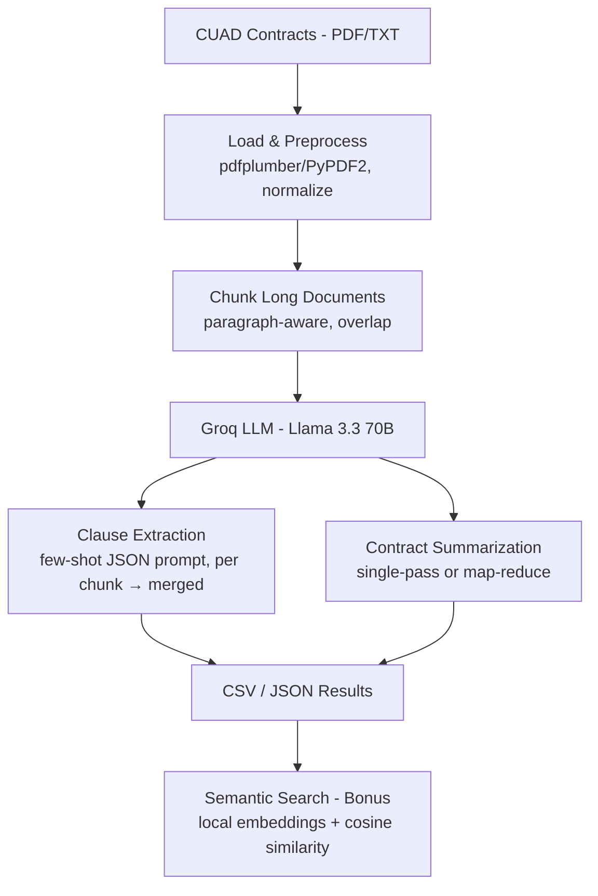

# CUAD Contract Clause Extraction & Summarization Pipeline

An LLM-powered pipeline that analyzes legal contracts from [CUAD](https://www.atticusprojectai.org/cuad),
extracts termination / confidentiality / liability clauses, and generates a
concise 100–150 word summary of each contract.

## Features

- Extracts Termination, Confidentiality, and Liability clauses
- Generates concise 100–150 word contract summaries
- Supports both PDF and TXT contracts
- Handles long contracts using paragraph-aware chunking
- Uses Groq-hosted Llama 3.3 70B for fast inference
- Performs semantic search using local Sentence Transformer embeddings
- Exports results in CSV and JSON formats

## Setup

**macOS / Linux**
```bash
git clone https://github.com/mansa2004/Document-Processing-with-LLMs.git
cd Document-Processing-with-LLMs
python3 -m venv .venv
source .venv/bin/activate
pip install -r requirements.txt
cp .env.example .env   # add your GROQ_API_KEY
```

**Windows (PowerShell)**
```powershell
git clone https://github.com/mansa2004/Document-Processing-with-LLMs.git
cd Document-Processing-with-LLMs
python -m venv .venv
.venv\Scripts\Activate.ps1
pip install -r requirements.txt
copy .env.example .env   # add your GROQ_API_KEY
```

> **Using Command Prompt instead of PowerShell?** Replace
> `.venv\Scripts\Activate.ps1` with `.venv\Scripts\activate.bat`, and write
> any multi-line command below as a single line (cmd doesn't support the
> `` ` `` continuation character used in the PowerShell examples).

> **PowerShell execution-policy error?** If `Activate.ps1` fails to run, open
> PowerShell as Administrator once and run:
> ```powershell
> Set-ExecutionPolicy -ExecutionPolicy RemoteSigned -Scope CurrentUser
> ```
> then retry activation.

> `requirements.txt` includes `torch` (~120 MB) for local embeddings — a slow
> or unstable connection can cause the download to fail mid-transfer. See
> **Known Limitations** for a workaround if that happens.

The pipeline uses the Groq API with `llama-3.3-70b-versatile` by default.
The model can be changed using the `GROQ_MODEL` environment variable.

> **Note:** Processing large batches may exceed the Groq free-tier token
> quota. If the daily quota is reached, the pipeline records the error for
> that contract and continues processing the remaining contracts.

## Get the data

Download CUAD v1 from the [Atticus Project](https://www.atticusprojectai.org/cuad)
and point `--input_dir` at the extracted `full_contract_txt/` or
`full_contract_pdf/` folder.

The loader accepts a mix of `.txt` and `.pdf` files. When both exist for the
same contract it prefers `.txt` (CUAD's plain-text mirror is already clean,
so this avoids unnecessary PDF parsing on a full 50-contract run). PDF
extraction (`pdfplumber`, falling back to `PyPDF2`) is fully implemented and
used automatically for any contract that only has a `.pdf` available. To
explicitly exercise and verify the PDF path, point `--input_dir` directly at
`full_contract_pdf/` instead:

```bash
python run_pipeline.py --input_dir /path/to/CUAD_v1/full_contract_pdf --limit 3
```

No download handy? A demo contract ships at
`sample_data/contracts/DEMO_SoftwareLicenseAgreement.txt` — see the
single-contract command in **Run** below to try it immediately.

## Run

Start with a single contract to confirm everything is wired up correctly
before running the full batch (recommended — avoids burning API quota if
something's misconfigured):

```bash
python run_pipeline.py --input_dir sample_data/contracts --output_dir output --limit 1
```

Once that succeeds, run the full batch against your CUAD download:

**macOS / Linux**
```bash
python run_pipeline.py \
    --input_dir /path/to/CUAD_v1/full_contract_txt \
    --output_dir output \
    --limit 50
```

**Windows (PowerShell)**
```powershell
python run_pipeline.py `
    --input_dir C:\path\to\CUAD_v1\full_contract_txt `
    --output_dir output `
    --limit 50
```

> The 50 contracts processed are simply the first 50 found in `--input_dir`
> (sorted alphabetically by filename). Use `--limit 0` to process every
> contract in the folder instead, or point `--input_dir` at a
> pre-filtered subfolder if you want a specific selection.

The pipeline generates:

- `output/clause_extraction_results.csv`
- `output/clause_extraction_results.json`

Each record contains:

- `contract_id`
- `summary`
- `termination_clause`
- `confidentiality_clause`
- `liability_clause`

| Flag | Purpose |
|---|---|
| `--no_few_shot` | Run clause extraction zero-shot, for A/B comparison |
| `--limit 0` | Process every contract found |
| `--verbose` | Debug logging |

### Sample Output

Real output from a run against CUAD contracts:

```json
{
  "contract_id": "ABILITYINC_06_15_2020-EX-4.25-SERVICES AGREEMENT",
  "num_chars": 26260,
  "summary": "The agreement is between the Provider and the Recipient, which includes TELCOSTAR PTE, LTD and Ability Computer & Software Industries Ltd. The purpose of the agreement is for the Provider to provide certain services and resources to the Recipient. The Provider must provide services in good faith and in accordance with applicable law, while the Recipient is obligated to pay fees. The agreement can be terminated by either party with prior written notice, and upon termination, the Provider must return all Recipient-owned property and confidential information...",
  "termination_clause": "Either party may terminate without cause with 90 days' written notice; either party may terminate for material breach if uncured after 30 days' notice; termination also possible upon insolvency or bankruptcy of the other party.",
  "confidentiality_clause": "Parties must maintain each other's Confidential Information in confidence, using at least reasonable care, and only disclose for the Permitted Purpose or as required by law; obligation survives termination.",
  "liability_clause": "Provider shall indemnify Recipient against losses arising from Provider's negligence, willful misconduct, or breach of this Agreement."
}
```

When a clause type genuinely isn't present in a contract, the pipeline
returns `""` rather than hallucinating a plausible-sounding clause — verified
on a real run against a joint venture agreement with no confidentiality or
liability terms.

### Tests

```bash
pytest tests/
```
Covers text normalization, chunking, and JSON-parsing robustness — no API key required. Same command on all operating systems.

### Bonus: semantic search

```bash
python search_clauses.py --contract sample_data/contracts/DEMO_SoftwareLicenseAgreement.txt --query "short termination notice period"
```
(Same command on all operating systems — only paths change if you're pointing at a Windows-style path, e.g. `sample_data\contracts\DEMO_SoftwareLicenseAgreement.txt`.)

Embeds the contract locally via `sentence-transformers` (no extra API key)
and returns the top-k passages closest to the query, even without lexical
overlap with the source wording.

## Approach

### Data Loading
Loads `.txt` directly when available, falls back to `pdfplumber`/`PyPDF2`
for PDF-only contracts; normalizes whitespace and unicode; chunks long
contracts on paragraph boundaries with overlap so clauses spanning a chunk
edge aren't lost.

### Clause Extraction
A structured JSON prompt with few-shot examples (toggle off via
`--no_few_shot`), run per-chunk and merged by keeping the longest
non-empty hit per clause type. Responses are parsed defensively to survive
stray markdown fences or malformed JSON without failing the batch.

### Summarization
Single-pass for short contracts; map-reduce (per-chunk summary → final
combine) for long ones, keeping every summary within the 100–150 word
budget regardless of contract length.



## Tech Stack

- Python
- Groq API (Llama 3.3 70B)
- Sentence Transformers (local embeddings)
- pdfplumber / PyPDF2 (PDF text extraction)
- pandas (CSV/JSON output)
- scikit-learn (cosine similarity for semantic search)

## Known Limitations

- Extraction quality has been reviewed qualitatively (see **Sample Output**)
  rather than scored against CUAD's ground-truth clause annotations.
- Groq's free-tier token quota may not be sufficient to process all 50
  contracts in one run; if exceeded, the pipeline records the error for
  that contract and continues with the rest.
